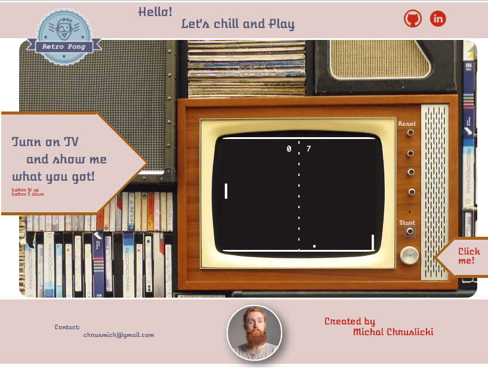

# Pong Game (Projekt Koncowy dla CodersLab.pl)
> v 1.0.0
> https://miczys.github.io/Pong-Game/
> I used Vanilla js, html and css for repetition ^_-

## How to start ?

1. For run the TV just click on the TV biggest button :) .
2. To start the game klick to the Start button on TV.
3. To moving up and down use W and S buttons.
4. When you want to start againg, click Reset button on the top and then Start button again.
5. Have fun :) .

